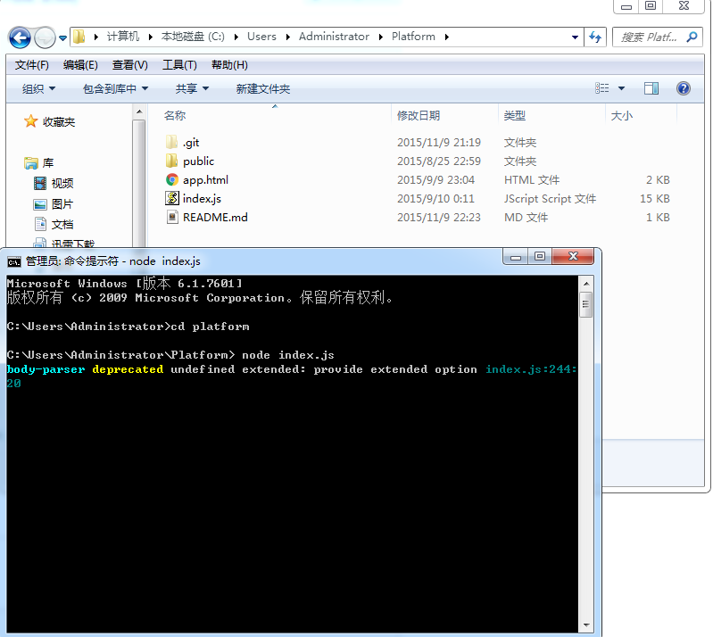

# A Platform Demo 
# 仿微信公众管理平台
# 利用Express框架模拟前后端交互

---

## 环境
- node.js
- Express

---

## 运行测试
1. 进入测试文件根目录，启动服务器文件**index.js**

2. 访问localhost，进入主页

3. 输入用户名和密码后， 点击登录，验证账户正确性，模拟前后端交互

4. 访问localhost/reg.html，进入注册页面

5. 注册页面会实时验证邮箱可用性，已经注册过的邮箱以及错误的邮箱格式均会提示，

6. 访问localhost/我的素材.html，进入我的素材管理页面

7. 我的素材管理页面，主体内容为后端传输数据，

8. 当我的素材管理页面，内容页面跳转时，同样会实时同后端进行交互，拿到下一月需要显示的内容

9. 我的素材管理页面，内容模块信息是可创建、可编辑、可删除的

10. 测试使用后端数据库，包含在服务器文件**index.js**中的**user**对象中
